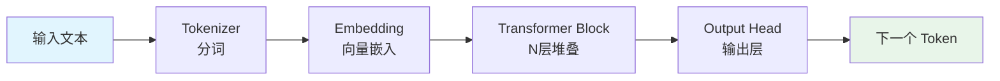
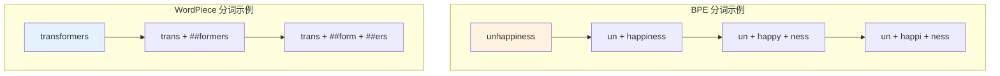
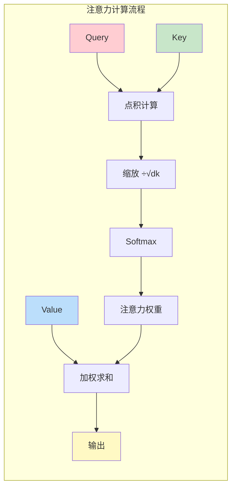
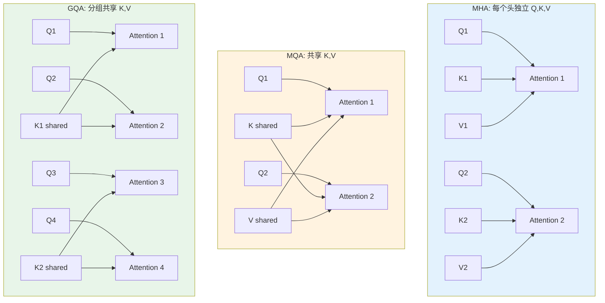
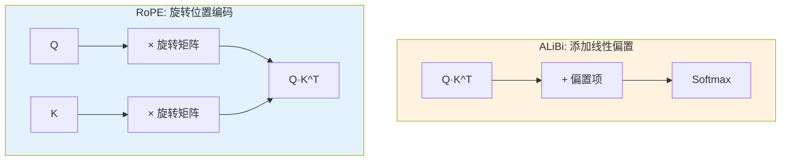
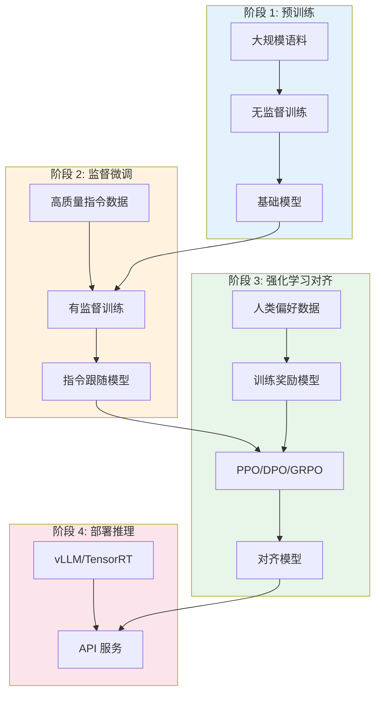
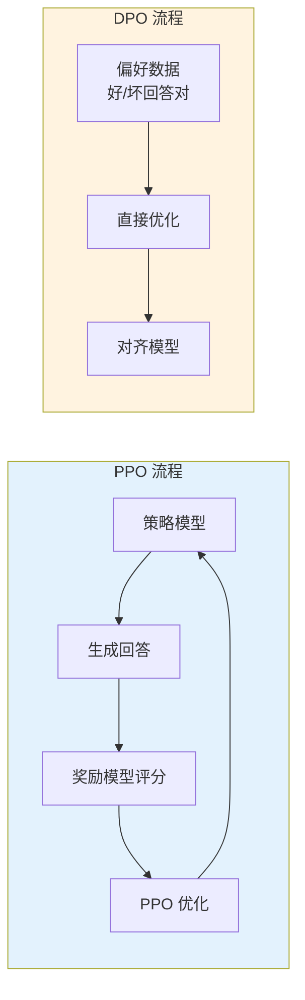
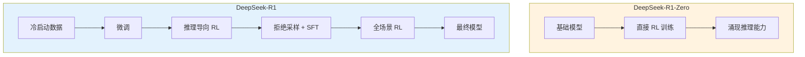
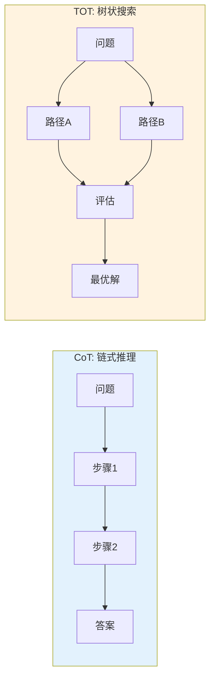
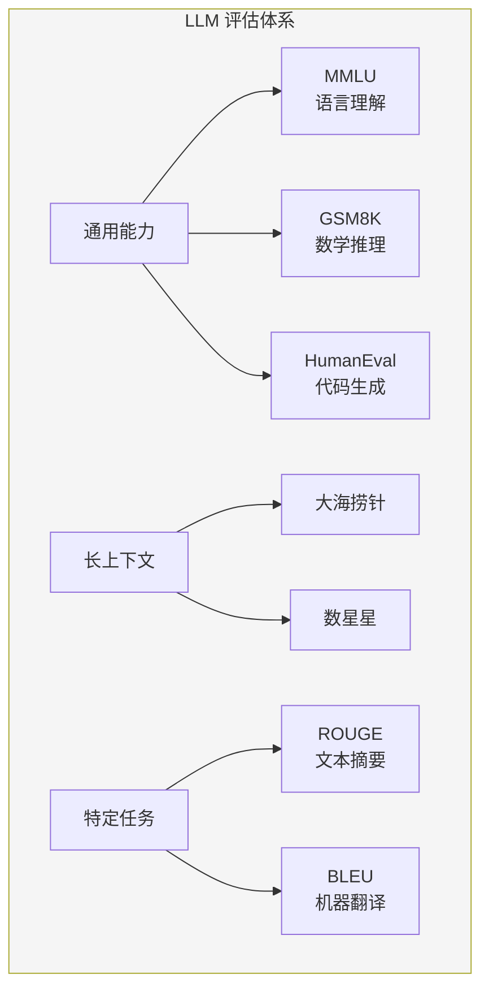

# LLM 通用学习笔记

> LLM（大语言模型）的本质是一个文本生成模型，采用 token2token 模式。与早期 BERT 的主要区别在于更大的预训练数据量、更长的训练时间和更丰富的数据（In-Context Learning、RLHF）。

---

## 一、核心问题速查

| 问题 | 解决方案 |
|:---|:---|
| 位置编码长度固定 | 可变位置编码（RoPE、ALiBi、YaRN） |
| 长序列计算量暴增 | Sparse Attention、Sliding Window Attention、MQA、GQA、KV Cache |
| 训练资源不够 | 模型并行、数据并行、张量并行、DeepSpeed ZeRO、Gradient Checkpoint |
| 训练推理加速 | FlashAttention、PagedAttention、GPTQ、Int8 量化 |
| 长文本遗忘、世界知识更新 | RAG、Sparse Attention、Function Calling |

---

## 二、模型架构

### 2.1 整体流程



大模型从输入到输出的完整流程：

1. **分词（Tokenization）**：输入文本通过 Tokenizer 转换为数字序列（词汇表中的索引）
2. **向量嵌入（Embedding）**：将数字序列通过 Embedding 层转换为高维向量
3. **位置编码（Position Encoding）**：添加位置信息，让模型知道 token 的顺序
4. **Transformer Block**：多层堆叠的注意力机制和前馈网络
5. **输出层**：将隐藏状态映射回词汇表大小，预测下一个 token

### 2.2 Tokenizer

在 LLM 中，Tokenizer 是将文本转换为模型可以理解的数值数据的关键组件。

| 分词方法 | 原理 | 代表模型 |
|:---|:---|:---|
| **BPE（Byte Pair Encoding）** | 迭代合并频繁出现的字符序列 | GPT、GPT-2、Qwen |
| **WordPiece** | 基于概率（而非频率）形成子词单元 | BERT |
| **Unigram** | 基于概率模型，优化下一个词出现的概率 | T5、AlBERT、XLNet |
| **SentencePiece** | 内置 BPE/Unigram，以 Unicode 直接编码整个句子 | ChatGLM、LLaMA |



**参考资料**：
- Tokenizer 详解：https://zhuanlan.zhihu.com/p/651430181

### 2.3 Attention 机制

#### Scaled Dot-Product Attention

给定输入序列，自注意力机制计算每个元素对其他元素的注意力权重：

```math
\text{Attention}(Q, K, V) = \text{Softmax}\left(\frac{QK^T}{\sqrt{d_k}}\right)V
```

**计算步骤**：
1. **计算 Q、K、V**：$$Q = XW^Q$$，$$K = XW^K$$，$$V = XW^V$$
2. **计算注意力分数**：$$\text{Scores} = QK^T$$
3. **缩放**：$$\text{Scaled Scores} = \frac{QK^T}{\sqrt{d_k}}$$
4. **Softmax 归一化**：$$\text{Weights} = \text{Softmax}(\text{Scaled Scores})$$
5. **加权求和**：$$\text{Output} = \text{Weights} \cdot V$$



#### 多头注意力变体

| 变体 | 特点 | 优势 |
|:---|:---|:---|
| **MHA（Multi-Head Attention）** | 每个头有独立的 Q、K、V | 捕捉多方面信息 |
| **MQA（Multi-Query Attention）** | 所有头共享 K、V | 减少 KV Cache，加速推理 |
| **GQA（Grouped-Query Attention）** | 分组共享 K、V | 平衡 MHA 和 MQA |
| **MLA（Multi-head Latent Attention）** | DeepSeek 提出，压缩 KV Cache | 访存密集型→计算密集型 |



**参考资料**：
- 稀疏注意力：https://zhuanlan.zhihu.com/p/691296437

#### DeepSeek MLA 详解

DeepSeek 的 Multi-head Latent Attention（MLA）是一种创新的注意力机制：

1. **核心思想**：减少 KV Cache，增加计算量（访存密集型→计算密集型）
2. **RoPE 兼容方案**：对 128 维度不做位置编码，对 64 维度做 RoPE（约 1/3 维度）

### 2.4 Position Embedding（位置编码）

位置编码让模型知道 token 在序列中的位置信息。

#### 绝对位置编码

**正弦余弦位置编码**（Transformer 原始论文）：

```math
PE_{(pos, 2i)} = \sin\left(\frac{pos}{10000^{2i/d_{model}}}\right)
```
```math
PE_{(pos, 2i+1)} = \cos\left(\frac{pos}{10000^{2i/d_{model}}}\right)
```

#### 相对位置编码

| 方法 | 原理 | 特点 |
|:---|:---|:---|
| **ALiBi** | 在 Softmax 结果后添加静态偏置 | 无需学习，可外推 |
| **RoPE** | 将位置信息融入 Q、K 的旋转 | 支持相对位置，广泛使用 |
| **YaRN** | 扩展 RoPE 以支持更长上下文 | 无需额外训练 |



**YaRN（Yet another RoPE extensioN）**：
- 通过改进 RoPE，让模型处理比训练时更长的序列
- 计算波长，生成新的位置编码
- 无需额外训练，通过插值扩展上下文窗口

**参考资料**：
- RoPE 详解：https://bytedance.larkoffice.com/wiki/YvppwCqy4imVcxkTEAkcAzZZn3z
- 变长位置编码：https://blog.csdn.net/qq_41739364/article/details/136068939

---

## 三、训练流程

### 3.1 训练流程概览



### 3.2 预训练（Pre-training）

在大量语料上进行无监督训练，获得通用的语言表示。

**关键要素**：
- **训练目标**：下一个 Token 预测（Causal LM）
- **数据规模**：万亿级 token（如 LLaMA 3 使用 15.6T tokens）
- **优化器**：AdamW，β₁=0.9, β₂=0.95
- **学习率调度**：线性预热 → 余弦衰减
- **混合精度**：BF16 + FlashAttention

### 3.3 监督微调（Fine-tuning）

在预训练基础上，使用下游任务数据进行监督微调。

**微调方法**：

| 方法 | 原理 | 适用场景 |
|:---|:---|:---|
| **全参数微调** | 更新所有参数 | 资源充足，追求最佳效果 |
| **LoRA** | 低秩适配，只训练少量参数 | 资源有限，快速实验 |
| **QLoRA** | 4-bit 量化 + LoRA | 显存极度有限 |

### 3.4 强化学习（RLHF）

对齐人类偏好，让模型更符合人类期望。



**主要方法**：
- **PPO（Proximal Policy Optimization）**：OpenAI 使用的经典方法
- **DPO（Direct Preference Optimization）**：更简单稳定，无需奖励模型
- **GRPO（Group Relative Policy Optimization）**：DeepSeek 提出的方法

**参考资料**：
- 强化学习基础：https://mofanpy.com/tutorials/machine-learning/reinforcement-learning/
- PPO/DPO 详解：https://blog.csdn.net/shizheng_Li/article/details/144433270
- GRPO 讲解：https://www.bilibili.com/video/BV1enQLYKEA5/

### 3.5 DeepSeek-R1 训练流程

DeepSeek-R1 是一个典型的 RLHF 训练案例：



**关键发现**：
- 无需 SFT 数据，直接 RL 可涌现推理能力
- 奖励窃取（Reward Hacking）是主要挑战
- 多数投票可进一步提升性能

---

## 四、常见开源模型

### 4.1 模型架构对比

| 模型 | 架构 | 参数量 | 特点 |
|:---|:---|:---|:---|
| **GPT 系列** | Decoder-only | 175B+ | 开启 LLM 时代 |
| **LLaMA 系列** | Decoder-only | 7B-405B | Meta 开源，广泛使用 |
| **BERT** | Encoder-only | 110M-340M | 理解型模型 |
| **T5** | Encoder-Decoder | 60M-11B | 统一文本到文本框架 |
| **Qwen** | Decoder-only | 0.5B-72B | 阿里开源，中文优秀 |
| **DeepSeek** | Decoder-only + MoE | 7B-671B | 推理能力强 |

### 4.2 重点模型详解

#### LLaMA 系列
- **LLaMA 2**：RoPE、RMSNorm、GQA、KV Cache
- **LLaMA 3**：15.6T tokens 训练，128K 上下文
- **LLaMA 4**：MoE 架构，1M 上下文

**参考资料**：
- LLaMA 系列：https://www.drinkingfishingseeking.com/2025/01/05/llm-llama/

#### 多模态模型

| 模型 | 架构 | 特点 |
|:---|:---|:---|
| **CLIP** | ViT + Text Encoder | 对比学习，图文对齐 |
| **BLIP** | MED 架构 | CapFilt 机制筛选数据 |
| **BLIP2** | Q-Former | 高效视觉语言预训练 |
| **LLaVA** | ViT + LLaMA | 简单高效的多模态 |
| **ALBEF** | ViT + BERT | 动量蒸馏 |

**参考资料**：
- 多模态综述：https://blog.csdn.net/qq_40168949/article/details/130374733

---

## 五、使用方法

### 5.1 Prompt 技巧

| 技术 | 原理 | 应用 |
|:---|:---|:---|
| **CoT（Chain-of-Thought）** | 引导模型逐步推理 | 复杂推理任务 |
| **TOT（Tree-of-Thought）** | 树状搜索多条推理路径 | 需要探索的任务 |
| **ICL（In-Context Learning）** | 在上下文中提供示例 | Few-shot 学习 |
| **Self-Consistency** | 多次采样取一致性结果 | 提高可靠性 |



**参考资料**：
- CoT：https://github.com/amazon-science/auto-cot

### 5.2 训练数据处理

| 方法 | 原理 | 应用 |
|:---|:---|:---|
| **Self-Instruct** | 模型自生成训练数据 | 数据增强 |
| **Evol-Instruct** | 深度和广度两个维度演化指令 | 指令多样化 |

**参考资料**：
- Self-Instruct：https://github.com/yizhongw/self-instruct
- Evol-Instruct：https://github.com/nlpxucan/evol-instruct

### 5.3 Agent 相关

| 技术 | 原理 | 应用 |
|:---|:---|:---|
| **RAG** | 检索增强生成 | 知识更新，减少幻觉 |
| **Function Calling** | 调用外部工具/API | 扩展模型能力 |
| **Structured Output** | 结构化输出 | JSON 等格式输出 |

**参考资料**：
- RAG 详解：https://zhuanlan.zhihu.com/p/682253496
- LangChain：https://github.com/liaokongVFX/LangChain-Chinese-Getting-Started-Guide
- LlamaIndex：https://docs.llamaindex.ai/en/stable/
- Function Calling：https://platform.openai.com/docs/guides/function-calling

---

## 六、代码实践

### 6.1 从零实现

1. **手写 Decoder-only 大模型 + 预训练**
   - 教程：https://blog.csdn.net/wl1780852311/article/details/121033915

2. **构建 LLaVA 多模态模型**
   - 代码：https://github.com/yuanzhoulvpi2017/zero_nlp/blob/main/train_llava/code03_build_model_show.ipynb

3. **Transformers NLP 入门**
   - 教程：https://github.com/datawhalechina/learn-nlp-with-transformers

### 6.2 常用框架

| 框架 | 用途 | 链接 |
|:---|:---|:---|
| **Transformers** | 模型加载/推理/微调 | https://github.com/huggingface/transformers |
| **LLaMA-Factory** | 一键微调 | https://github.com/hiyouga/LLaMA-Factory |
| **OpenRLHF** | 高效 RL 训练 | https://github.com/OpenRLHF/OpenRLHF |
| **vLLM** | 高效推理部署 | https://docs.vllm.ai/en/latest/ |
| **DeepSpeed** | 分布式训练加速 | https://github.com/microsoft/DeepSpeed |

---

## 七、评估方法

### 7.1 评估体系



### 7.2 长上下文评估

**大海捞针实验**：
- 将一个与文本语料不相关的句子藏入文本中
- 测试模型能否准确提取这句话
- 评估不同位置和长度下的表现

**参考资料**：
- 大海捞针：https://github.com/gkamradt/LLMTest_NeedleInAHaystack
- 数星星：https://github.com/nick7nlp/Counting-Stars

### 7.3 评估指标

| 任务 | 指标 | 说明 |
|:---|:---|:---|
| 文本摘要 | ROUGE | Recall-Oriented Understudy for Gisting Evaluation |
| 机器翻译 | BLEU、METEOR、CIDEr | 多种指标综合评估 |
| 下游任务 | MMLU、GSM8K、HumanEval | 通用能力基准 |
| RAG 系统 | RAGAS | 检索增强生成评估 |

**参考资料**：
- RAGAS：https://docs.ragas.io/en/stable/getstarted/rag_evaluation/

---

## 八、技巧与实践

### 8.1 模型下载

使用 `huggingface-cli` 下载模型：

```bash
# 安装依赖
pip install -U huggingface_hub

# 设置镜像
export HF_ENDPOINT=https://hf-mirror.com

# 下载模型
huggingface-cli download --resume-download \
    --local-dir-use-symlinks False \
    Qwen/Qwen2.5-72B-Instruct-GPTQ-Int8 \
    --local-dir /path/to/save
```

### 8.2 SFT 训练参数

| 参数 | 建议值 | 说明 |
|:---|:---|:---|
| 学习率 | 预训练的 0.1 | 如预训练 9e-5，SFT 用 9e-6 |
| warmup_ratio | 0.01-0.015 | 较小值使收敛更平滑 |
| Epoch | 2-5 | 小数据集可增大，避免欠拟合 |

**注意**：
- SFT 样本较少时，过拟合优于欠拟合
- 任务类型多时，可添加 system_prompt 区分任务

---

## 九、系列教程

- GPT 系列：https://www.drinkingfishingseeking.com/2025/01/04/llm-gpt/
- LLaMA 系列：https://www.drinkingfishingseeking.com/2025/01/05/llm-llama/
- 综合教程：https://www.drinkingfishingseeking.com
- 机器学习基础：https://www.showmeai.tech/tutorials/34?articleId=184
- AI 数学基础：https://www.showmeai.tech/tutorials/83
