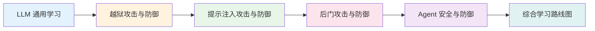

# LLM 安全学习笔记

## 系统梳理 LLM 安全领域四大方向

从基础理论到安全攻防前沿，构建完整的 LLM 安全知识体系

---

## 关于本站

本站是基于个人学习笔记构建的静态知识库，涵盖了从 LLM 基础理论到安全攻防前沿的系统性内容。所有内容均以 Markdown 原文呈现，支持全文搜索、深色模式、LaTeX 公式渲染等现代阅读体验。

4
安全方向

50+
论文精读

10+
代码实践

100+
知识条目

---

## 内容概览

-   :material-shield-off-outline:{ .lg .middle } __LLM 安全专题__

    ---

    系统梳理 LLM 安全四大方向：越狱攻击、后门攻击、提示注入、Agent 安全。每个方向包含经典论文精读、前沿进展追踪、核心概念解析与可操作方法论。

    [:octicons-arrow-right-24: 进入专题](llm_safety/index.md)

-   :material-brain:{ .lg .middle } __LLM 通用学习__

    ---

    大语言模型的基础理论：从 Tokenizer、Attention 机制到训练加速、长文本处理等工程实践知识。包含 Mermaid 图解和代码示例。

    [:octicons-arrow-right-24: 开始学习](llm_study.md)

-   :material-book-open-variant:{ .lg .middle } __研究经验__

    ---

    论文阅读方法（三遍阅读法）、代码设计标准、论文写作指南（从 Related Work 到 Conclusion 的完整流程）。

    [:octicons-arrow-right-24: 查看经验](research/index.md)

---

## 四大安全方向

| 方向 | 核心关键词 | 代表工作 |
|:---|:---|:---|
| **越狱攻击与防御** | 竞争目标、泛化错配、GCG、AutoDAN、PAIR、TAP | Wei et al. (NeurIPS 2023), Zou et al. (2023) |
| **后门攻击与防御** | 触发器、Sleeper Agents、BadChain、ONION、ConfGuard | Hubinger et al. (Anthropic, 2024), Xiang et al. (ICLR 2024) |
| **提示注入攻击与防御** | 直接注入、间接注入、IPI、Instruction Hierarchy、PALADIN | Perez & Ribeiro (2022), Greshake et al. (AISec 2023) |
| **Agent 安全与防御** | ReAct、ToolEmu、ClawWorm、ToolSafe、MCP 协议 | Yao et al. (ICLR 2023), Ruan et al. (NeurIPS 2024) |

---

## 使用指南

-   :material-magnify:{ .lg } __全文搜索__

    ---

    点击右上角搜索图标，支持中英文全文检索所有笔记内容。

-   :material-weather-sunny:{ .lg } __深色模式__

    ---

    点击右上角太阳/月亮图标，切换深色/浅色模式，保护眼睛。

-   :material-menu:{ .lg } __导航结构__

    ---

    顶部导航栏切换板块，左侧目录树浏览章节，右侧目录快速跳转。

-   :material-arrow-up-bold:{ .lg } __返回顶部__

    ---

    阅读长文时，右下角会出现返回顶部按钮，方便快速导航。

---

## 学习路径建议

如果你是这个领域的新手，建议按以下顺序阅读：

1. **先读** [LLM 通用学习](llm_study.md) —— 建立模型基础认知
2. **再读** [越狱攻击与防御](llm_safety/sec01.md) —— 这是目前最成熟、论文最多的方向
3. **然后** [提示注入攻击与防御](llm_safety/sec03.md) —— 实践危害性最高，与工程结合最紧密
4. **接着** [后门攻击与防御](llm_safety/sec02.md) —— 训练时威胁，理解难度稍高
5. **最后** [Agent 安全与防御](llm_safety/sec04.md) —— 最前沿、发展最快的方向
6. **参考** [综合学习路线图](llm_safety/sec05.md) —— 制定个人学习计划

---

## 技术栈

| 组件 | 技术 | 说明 |
|:---|:---|:---|
| 静态站点生成 | MkDocs Material | 现代化文档主题 |
| 公式渲染 | MathJax 3 | 支持 LaTeX 数学公式 |
| 图表绘制 | Mermaid | 支持流程图、时序图等 |
| 部署 | GitHub Actions | 自动构建部署到 GitHub Pages |

---

> 本仓库内容属于**学术研究与学习笔记**，讨论的攻击方法仅用于安全防御研究。

---

Made with :material-heart:{ .md-heart } by Study_Experience

