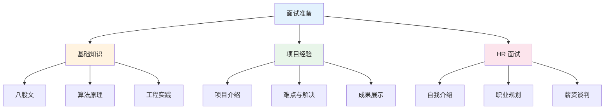

# 面试经验

## LLM/NLP 面试准备指南

八股文 · 面经总结 · 强化学习 · 模型架构 · 工程实践

---

## 内容概览

-   :material-book-open-variant:{ .lg .middle } __八股文__

    ---

    LLM 面试常见问题与标准答案，涵盖注意力机制、位置编码、微调方法等核心知识点。

    [:octicons-arrow-right-24: 查看八股](basics.md)

-   :material-clipboard-text:{ .lg .middle } __面经总结__

    ---

    真实面试经验总结，包含 KL 散度、DPO、灾难性遗忘、参数计算等高频问题。

    [:octicons-arrow-right-24: 查看面经](summary.md)

-   :material-account-tie:{ .lg .middle } __HR 面试__

    ---

    HR 面试常见问题与回答模板：自我介绍、职业规划、优缺点、薪资谈判等。

    [:octicons-arrow-right-24: 查看指南](hr.md)

-   :material-brain:{ .lg .middle } __强化学习__

    ---

    PPO、DPO、GRPO、DAPO、VAPO 等强化学习算法详解与面试要点。

    [:octicons-arrow-right-24: 查看详情](reinforcement_learning.md)

---

## 知识点分类

### 强化学习篇

| 主题 | 说明 | 链接 |
|:---|:---|:---|
| 强化学习基础 | 马尔可夫过程、奖励模型、基本概念 | [查看详情](reinforcement_learning.md) |
| PPO | 近端策略优化、GAE、TD-error | [查看详情](ppo.md) |
| DPO | 直接偏好优化、无需奖励模型 | [查看详情](dpo.md) |
| GRPO | 分组相对策略优化 | [查看详情](grpo.md) |
| DeepSeek R1 | R1 训练流程、冷启动、GRPO | [查看详情](deepseek_r1.md) |

### 模型架构篇

| 主题 | 说明 | 链接 |
|:---|:---|:---|
| 注意力机制 | MHA、MQA、GQA、MLA、Flash Attention | [查看详情](attention.md) |
| BERT | Encoder 架构、预训练任务 | [查看详情](bert.md) |
| Qwen 系列 | Qwen1.5/2/3 架构演进 | [查看详情](qwen.md) |
| DeepSeek V3 | MoE 架构、训练策略 | [查看详情](deepseek_v3.md) |
| MoE | 混合专家模型原理 | [查看详情](moe.md) |

### 工程实践篇

| 主题 | 说明 | 链接 |
|:---|:---|:---|
| LoRA | 低秩适配、初始化、加速原理 | [查看详情](lora.md) |
| RAG | 检索增强生成、向量数据库 | [查看详情](rag.md) |
| vLLM | 推理引擎、PagedAttention | [查看详情](vllm.md) |
| DeepSpeed | ZeRO 1/2/3、分布式训练 | [查看详情](deepspeed.md) |
| Function Calling | 工具调用、API 集成 | [查看详情](function_calling.md) |

---

## 面试准备建议

### 学习路径

1. **第一阶段**：阅读 [八股文](basics.md) 掌握核心知识点
2. **第二阶段**：阅读 [面经总结](summary.md) 了解真实面试问题
3. **第三阶段**：深入学习强化学习（[PPO](ppo.md)、[DPO](dpo.md)、[GRPO](grpo.md)）
4. **第四阶段**：准备 [HR 面试](hr.md) 常见问题
5. **第五阶段**：复习模型架构（[BERT](bert.md)、[Qwen](qwen.md)、[DeepSeek](deepseek_v3.md)）

---

## 快速导航

| 想了解什么？ | 推荐阅读 |
|:---|:---|
| LLM 面试常见问题 | [八股文](basics.md) |
| 面试中被问到不会的问题 | [面经总结](summary.md) |
| PPO/DPO/GRPO 区别 | [强化学习](reinforcement_learning.md) |
| 如何介绍自己的项目 | [HR 面试](hr.md) |
| vLLM 原理 | [vLLM](vllm.md) |
| DeepSpeed ZeRO 原理 | [DeepSpeed](deepspeed.md) |

---

**提示**：左侧目录树可以快速切换章节，右上角搜索支持全文检索。

