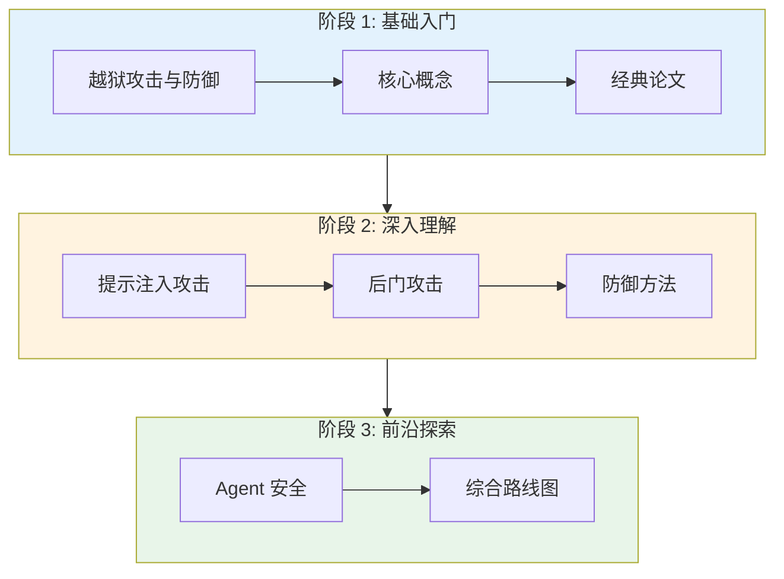

# LLM 安全专题

## 系统梳理 LLM 安全四大核心方向

越狱攻击 · 后门攻击 · 提示注入 · Agent 安全

---

## 四大安全方向

-   :material-skull-crossbones:{ .lg .middle } __越狱攻击与防御__

    ---

    从竞争目标与泛化错配理论出发，覆盖 GCG、AutoDAN、PAIR、TAP 等经典攻击与前沿进展。

    **关键词**：竞争目标、泛化错配、对抗样本

    [:octicons-arrow-right-24: 阅读章节](sec01.md)

-   :material-bug:{ .lg .middle } __后门攻击与防御__

    ---

    梳理触发器植入、Sleeper Agents、BadChain 等训练时威胁与检测方法。

    **关键词**：触发器、植入攻击、供应链威胁

    [:octicons-arrow-right-24: 阅读章节](sec02.md)

-   :material-injection:{ .lg .middle } __提示注入攻击与防御__

    ---

    从直接注入到间接注入，涵盖 Instruction Hierarchy、PALADIN 等防御框架。

    **关键词**：直接注入、间接注入、控制流劫持

    [:octicons-arrow-right-24: 阅读章节](sec03.md)

-   :material-robot:{ .lg .middle } __Agent 安全与防御__

    ---

    工具调用安全、多 Agent 协作风险、MCP 协议安全等前沿议题。

    **关键词**：工具安全、权限控制、沙箱隔离

    [:octicons-arrow-right-24: 阅读章节](sec04.md)

---

## 学习路径

---

## 专题结构

### 分章正文

| 章节 | 主题 | 核心内容 |
|:---|:---|:---|
| [第 1 章](sec01.md) | 越狱攻击与防御 | 竞争目标理论、GCG、AutoDAN、PAIR、TAP |
| [第 2 章](sec02.md) | 后门攻击与防御 | 触发器机制、Sleeper Agents、BadChain、检测方法 |
| [第 3 章](sec03.md) | 提示注入攻击与防御 | 直接/间接注入、Instruction Hierarchy、AgentDojo |
| [第 4 章](sec04.md) | Agent 安全与防御 | 工具调用安全、多 Agent 风险、MCP 协议 |
| [第 5 章](sec05.md) | 综合学习路线图 | 三阶段路径、Benchmarks、阅读优先级 |

### 辅助文档

-   :material-file-document:{ .lg } __完整版（单页）__

    ---

    将五章合并后的完整文档，适合打印或离线阅读。

    [:octicons-arrow-right-24: 查看完整版](complete.md)

-   :material-format-list-bulleted:{ .lg } __文档大纲__

    ---

    最终文档的完整目录结构，快速了解全貌。

    [:octicons-arrow-right-24: 查看大纲](outline.md)

-   :material-calendar-check:{ .lg } __执行计划__

    ---

    研究执行的三阶段计划：深度研究 → 报告撰写 → DOCX 格式化。

    [:octicons-arrow-right-24: 查看计划](plan.md)

### 原始调研素材

| 方向 | 调研内容 |
|:---|:---|
| [越狱方向](research/wide01_jailbreak.md) | 经典论文 + 前沿论文的详细摘要 |
| [后门方向](research/wide02_backdoor.md) | 触发器机制、防御策略的原始调研草稿 |
| [提示注入方向](research/wide03_prompt_injection.md) | 攻击面扩展与防御演化的深度调研 |
| [Agent 安全方向](research/wide04_agent.md) | 工具安全与智能体威胁模型的原始素材 |

---

## 快速导航

| 你想了解什么？ | 推荐阅读 |
|:---|:---|
| 越狱攻击为什么能成功？ | [sec01 - 核心概念](sec01.md) |
| 最新的黑盒自动化攻击方法 | [sec01 - 前沿论文](sec01.md) |
| 后门攻击的触发器长什么样？ | [sec02 - 核心概念](sec02.md) |
| 提示注入和越狱有什么区别？ | [sec03 - 经典论文](sec03.md) |
| Agent 调用工具时怎么被攻击？ | [sec04 - 攻击方法](sec04.md) |
| 不知道从哪里开始学？ | [sec05 - 完整学习路径](sec05.md) |

---

## 核心概念速查

-   :material-target:{ .lg } __攻击目标__

    ---

    - 让模型生成有害内容
    - 绕过安全对齐
    - 窃取敏感信息
    - 劫持控制流

-   :material-shield-check:{ .lg } __防御策略__

    ---

    - 输入过滤和检测
    - 输出安全审核
    - 模型对齐训练
    - 沙箱隔离执行

-   :material-chart-bar:{ .lg } __评估指标__

    ---

    - 攻击成功率（ASR）
    - 防御成功率（DSR）
    - 响应质量
    - 计算开销

-   :material-book-open:{ .lg } __经典论文__

    ---

    - Wei et al. (NeurIPS 2023)
    - Zou et al. (2023)
    - Hubinger et al. (2024)
    - Yao et al. (ICLR 2023)

---

**提示**：左侧目录树可以快速切换章节，右上角搜索支持全文检索。

