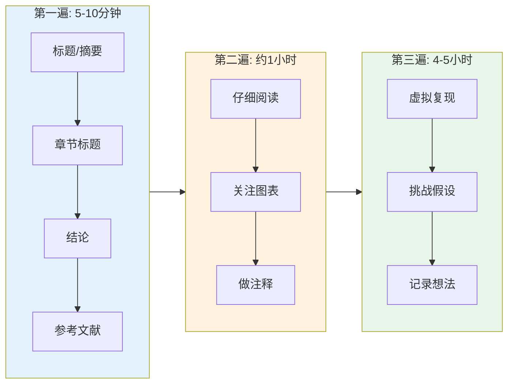
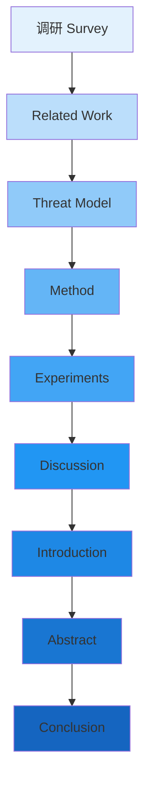
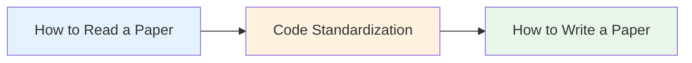

# 研究经验（Research Experience）

## 从论文阅读到论文写作的完整指南

整合论文阅读、代码规范和论文写作三方面的实用经验

---

## 内容概览

-   :material-book-open-page-variant:{ .lg .middle } __How to Read a Paper__

    ---

    基于 S. Keshav 的经典论文，介绍三遍阅读法、批判性与创造性阅读、文献综述方法。

    **预计阅读时间**：10 分钟

    [:octicons-arrow-right-24: 开始阅读](how_to_read.md)

-   :material-code-braces:{ .lg .middle } __Code Standardization__

    ---

    代码规范的基础和高级要求，包括兼容性设计、可读性命名、实验复现等最佳实践。

    **预计阅读时间**：5 分钟

    [:octicons-arrow-right-24: 查看规范](code_standard.md)

-   :material-pencil:{ .lg .middle } __How to Write a Paper__

    ---

    推荐的论文写作顺序：调研 → Related Work → Threat Model → Method → Experiments → Discussion → Introduction → Abstract → Conclusion。

    **预计阅读时间**：15 分钟

    [:octicons-arrow-right-24: 学习写作](how_to_write.md)

---

## 快速参考

### 论文阅读三遍法

| 遍数 | 时间 | 目标 | 输出 |
|:---|:---|:---|:---|
| 第一遍 | 5-10 分钟 | 鸟瞰全局 | 回答"五个 C" |
| 第二遍 | 约 1 小时 | 掌握内容 | 能向他人总结 |
| 第三遍 | 4-5 小时 | 深度理解 | 能重构论文结构 |

### 论文写作顺序

**关键原则**：不要从 Introduction 开始写！先写内容部分，最后写开头和结尾。

### 投稿前检查清单

-   :material-check-all:{ .lg } __内容检查__

    ---

    - [ ] 标题简洁且包含关键词
    - [ ] 摘要包含问题、方法、结果、意义
    - [ ] 引言清楚列出贡献
    - [ ] 相关工作突出与本文的区别

-   :material-check-all:{ .lg } __方法检查__

    ---

    - [ ] Threat Model 清晰定义（安全论文）
    - [ ] 方法部分先给直觉再给形式化
    - [ ] 实验有消融研究和统计检验
    - [ ] 图表清晰、标注完整

-   :material-check-all:{ .lg } __格式检查__

    ---

    - [ ] 检查拼写和语法
    - [ ] 参考文献格式一致
    - [ ] 遵守页数限制和格式要求
    - [ ] 代码和数据可以公开（如适用）

---

## 推荐阅读顺序

1. **先读** [How to Read a Paper](how_to_read.md) —— 掌握高效的论文阅读方法
2. **再读** [Code Standardization](code_standard.md) —— 了解代码规范和实验复现
3. **最后** [How to Write a Paper](how_to_write.md) —— 学习论文写作的最佳实践

---

## 参考资料

- S. Keshav, "How to Read a Paper," *ACM SIGCOMM CCR*, vol. 37, no. 3, pp. 83-84, 2007.
- Simon Peyton Jones, "How to Write a Great Research Paper," Microsoft Research, 2007.
- Timothy Roscoe, "Writing Reviews for Systems Conferences," 2007.
- *How to read a research paper*, 课程讲义.

---

**提示**：本页面左侧有子导航栏，可以快速切换到各个部分。

