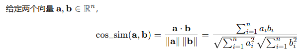

# CLIP

Owner: 吉祥 郑

[clip DALL-E](https://app.notion.com/p/clip-DALL-E-78e7ca303e62478cbd7dea97280d24da?pvs=21)

[(8 封私信) 神器CLIP：连接文本和图像，打造可迁移的视觉模型 - 知乎](https://zhuanlan.zhihu.com/p/493489688)

# 余弦相似度

只关注两者夹角值，越小越相似



# 对比学习

- 正样本：image和对应的text表述
- 负样本：image和其他表述

学习的目标就是，使得正样本的相似度不断提高，负样本的概率不断降低


## 伪代码

进行对比学习，相当于是算两次交叉熵，Image-Text和Text-Image


```python
# image_encoder - ResNet or Vision Transformer
# text_encoder - CBOW or Text Transformer
# I[n, h, w, c] - minibatch of aligned images
# T[n, l] - minibatch of aligned texts
# W_i[d_i, d_e] - learned proj of image to embed
# W_t[d_t, d_e] - learned proj of text to embed
# t - learned temperature parameter

# 分别提取图像特征和文本特征
I_f = image_encoder(I) #[n, d_i]
T_f = text_encoder(T) #[n, d_t]

# 对两个特征进行线性投射，得到相同维度的特征，并进行l2归一化
# 向量的长度都是单位长度
I_e = l2_normalize(np.dot(I_f, W_i), axis=1)
T_e = l2_normalize(np.dot(T_f, W_t), axis=1)

# 计算缩放的余弦相似度：[n, n]
# 这个相当于是算出了每一个Iamge embedding和Text embedding的相似度
logits = np.dot(I_e, T_e.T) * np.exp(t)

# 对称的对比学习损失：等价于N个类别的cross_entropy_loss
labels = np.arange(n) # 对角线元素的labels
# image->text（每行做softmax）
loss_i = cross_entropy_loss(logits, labels)
# text->image（转置后每行做softmax）        
loss_t = cross_entropy_loss(logits.T, labels)
loss = 0.5 * (loss_i + loss_t)
```

```python
import torch
import torch.nn.functional as F

# 假设输入
# I: [n, c, h, w] 图像batch
# T: [n, l] 文本token batch
# image_encoder, text_encoder 分别为图像和文本编码器
# W_i: [d_i, d_e] 图像线性投射矩阵
# W_t: [d_t, d_e] 文本线性投射矩阵
# t:   一个标量参数（log 温度）

def clip_loss(I, T, image_encoder, text_encoder, W_i, W_t, t):
    # 1️⃣ 提取图像与文本特征
    I_f = image_encoder(I)    # [n, d_i]
    T_f = text_encoder(T)     # [n, d_t]

    # 2️⃣ 线性投射到相同维度，并进行 L2 归一化
    I_e = F.normalize(I_f @ W_i, dim=1)  # [n, d_e]
    T_e = F.normalize(T_f @ W_t, dim=1)  # [n, d_e]

    # 3️⃣ 计算缩放的余弦相似度矩阵（对称）
    logit_scale = torch.exp(t)           # 温度缩放因子
    logits = logit_scale * (I_e @ T_e.t())  # [n, n]

    # 4️⃣ 构造标签（对角线为正样本）
    labels = torch.arange(logits.size(0), device=logits.device)

    # 5️⃣ 对称 InfoNCE / CrossEntropyLoss
    loss_i = F.cross_entropy(logits, labels)       # image → text
    loss_t = F.cross_entropy(logits.t(), labels)   # text → image
    loss = 0.5 * (loss_i + loss_t)

    return loss, logits

```

# Zero Shot分类

- 给出多个文本
- 给出多个图片
- 计算余弦相似度，通过softmax获得概率值


# 用途

- zero shot分类：写成a photo of {class}进行分类任务：
    - 一般不会使用一个class直接作为标签，效果不好，必须用一个prompt
    - 图片分割任务：把图片进行分割然后和目标标签进行匹配
- 把多模态信息映射到同一个嵌入空间，支持图找文，或是文找图
- 数据清洗：
    - 用数据进行最邻近去重
    - 去除图片和文本差异很大的样本