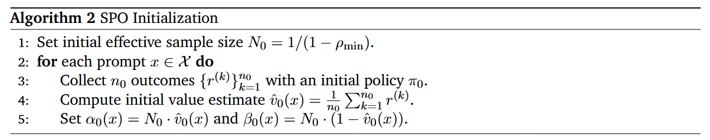

# SPO

Owner: 吉祥 郑

# GRPO存在问题

- **退化群组：**全0或是全1的group
- **同步时延：**一个group内生成完成的回复，需要等待没有生成结束的回复
- GROUP的大小不好确定：
    - 现在一般是用16或是32作为Group size，采样次数过少，导致GRPO估计出来的baseline是有高方差的，从而优势值的估计也是高方差的

# 方法

## Beta分布

[(12 封私信) 如何通俗理解 beta 分布？ - 知乎](https://www.zhihu.com/question/30269898/answer/1374596782)

- 进行A+B次实验，得到奖励1的次数是A，得到奖励0的次数是B
- 给出一个得到奖励1的概率p，利用极大似然估计的方法，估计p出现的靠谱程度
    
    
    
- 对0,1的所有靠谱程度（似然度）进行归一化，得到每个p出现的支持程度，即**在当前的数据分布下，奖励为1的概率为p的概率值**
    
    
    
- beta分布的期望和方差，期望就是进行了那么多次的采样，最可能的那个概率值：
    
    
    

## KL Adaptive Value Tracker

规则奖励只有0和1，当前模型的期望奖励未知，需要估计，使其作为baseline。

目的是利用近段时间以来，对于同一个prompt的失败和成功的统计，估计当前模型在这个prompt上的平均奖励。

### beta分布和条件伯努利分布估计当前策略下答对的平均奖励

- 一个prompt答对的概率服从概率值为p的伯努利分布
- beta分布用来表示，某个r=1的概率p出现的概率
- **beta作为先验分布与概率值为p的条件伯努利分布相乘得到后验分布（当前的数据出现的情况下，概率值为p的可能性）：**
    - 根据贝叶斯分布的公式，可以得到奖励值为1时，概率为p的后验分布
    - 后验分布仍然是一个beta分布（共轭特性），并且**新的beta分布的均值的计算只是把α和β，根据新的统计次数进行一个更新**
- 在后验分布上，对答对的概率p求均值，就可以得到当获取一组新的数据之后，当前对于一个prompt的期望奖励（r=1，系数1没写出来）
    
    
    

### 遗忘旧的采样

模型当前答对的概率应该是不断升高的，很久之前的样本不能对当前模型的能力进行合理的判断，**需要对旧的统计值进行一个discount：**

- 其中D(x)是该prompt在之前模型上和当前模型上的KL divergence

## 优势值估计和策略梯度优化

优势值的计算就是当前的reward减去统计得到的baseline

在进行实际策略梯度优化的过程中还会将当前的优势值再减去batch内部的归一化：

- 优势值去中心化，保证更新稳定
- 这样进行归一化之后，梯度的方向不变，只是乘上了一个系数，更加稳定了
    
    
    
- 课程学习（之后讲到的优先级采样），一定程度保证了，未经归一化的优势值是有正有负的

## 优先级采样（自适应课程学习）

在训练开始之前有一个初始化的步骤，会对训练数据集中的每一个样本进行初始的采样，用于评估初始策略的平均奖励

如果平均奖励是全0或全1，相当于这个问题太难或是简单，不希望采样这些样本，相对于也是渐进式课程学习的方法

