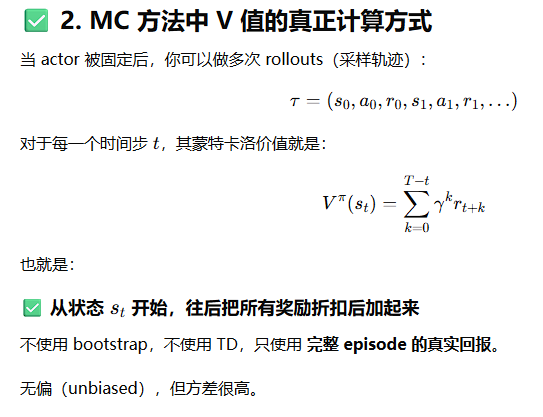

# VAPO

Owner: 吉祥 郑

# critic初始化

一般critic会从reward model进行初始化，但是这样一来，critic就会偏好给最后几个token打高分，这样一开始的偏差就很高

VAPO的解决方案是，直接对v进行蒙特卡洛采样，然后直接sft critic model，当偏差和方差在特定的范围内，再开始PPO的训练

# GAE解耦

由于PPO中的critic loss中有GAE，GAE会以λ指数形式进行递减：

- 使得靠前的token的value值很小：
    - 对于critic来说，如果λ小于1：
        - 那么一些很早期的token value完全依靠于当前token处的TD-error，偏差极大
        - 由于序列早期的value估计不准，更容易使得模型朝着reference model的方向靠近，难以出现长思维链
- 但是如果让λ为1，就退化为纯MC采样会使得policy model的梯度噪声更大，收敛很慢

因此critic计算和actor计算使用不同的λ：

- critic使用λ=1，就是纯MC；因为有critic预训练的过程，因此即使是纯MC，收敛的速度也还可以接受
- actor使用λ=0.95，使得收敛更加容易

# 使得GAE适应长短不一的序列（动态λ）

如果序列很长，那么GAE衰减的很严重，传到前面优势值可能就没有了；序列很短，又会使得后面的优势值过分影响之前的优势值：

**因此短序列用更小的λ；长序列用更大的λ**