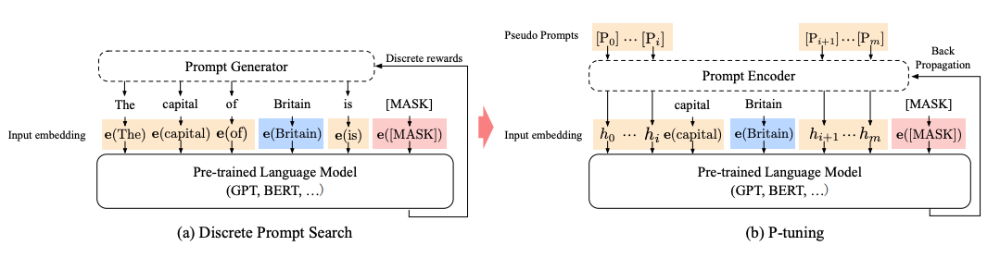

# Prompt-tuning

Owner: 吉祥 郑

https://wjn1996.blog.csdn.net/article/details/120607050

https://blog.csdn.net/qq_24729325/article/details/132673944

截止23年3月底，语言模型走过了三个阶段：

- **第一阶段** ：设计一系列的自监督训练目标（MLM、NSP等），设计新颖的模型架构（Transformer），遵循Pre-training和Fine-tuning范式。典型代表是BERT、GPT、XLNet等；
- **第二阶段** ：逐步扩大模型参数和训练语料规模，探索不同类型的架构。典型代表是BART、T5、GPT-3等；
- **第三阶段** ：走向AIGC（Artificial Intelligent Generated Content）时代，模型参数规模步入千万亿，模型架构为自回归架构，大模型走向对话式、生成式、多模态时代，更加注重与人类交互进行对齐，实现可靠、安全、无毒的模型。典型代表是InstructionGPT、ChatGPT、Bard、GPT-4等。

Prompt-Tuning的动机旨在解决目前传统Fine-tuning的两个痛点问题：

- **降低语义差异（Bridge the gap between Pre-training and Fine-tuning）** ：预训练任务主要以Masked Language Modeling（MLM）为主，而下游任务则重新引入新的训练参数，因此两个阶段的目标通常有较大差异。因此需要解决如何缩小Pre-training和Fine-tuning两个阶段目标差距过大的问题；
- **避免过拟合（Overfitting of the head）** ：由于在Fine-tuning阶段需要新引入额外的参数以适配相应的任务需要，因此在样本数量有限的情况容易发生过拟合，降低了模型的泛化能力。因此需要面对预训练语言模型的过拟合问题。

博主根据对Prompt-Tuning两年多的研究经验，总结了三个关于Prompt的本质，如下：

- Prompt的本质是一种对任务的指令；
- Prompt的本质是一种对预训练任务的复用；
- Prompt的本质是一种参数有效性学习；

由于绝大多数的语言模型都采用MLM或ALM进行训练，所以我们现如今所看到的大多数基于Prompt的分类都要设计Template和Verbalizer。那么我们是否可以极大化地利用MLM和ALM的先验知识在不同的下游任务上获得更好的表现？是否可以设计一个全新的预训练任务来满足一些下游任务的需求呢？

我们介绍两个充分利用这个思想的方法：

- **万物皆可生成** ：将所有任务统一为文本生成，极大化利用单向语言模型目标；
- **万物皆可抽取** ：将所有任务统一为抽取式阅读理解，并设计抽取式预训练目标；
- **万物皆可推理** ：将所有任务建模为自然语言推断（Natural Language Inference）或相似度匹配任务。

### Prompt的本质是参数有效性学习

根据前文的讲解，我们可以发现，实现Prompt-Tuning只需要考虑如何设计模板或指令，而模型和训练目标则都是复用预训练阶段的，即在整个训练过程中，无须添加任何参数（或只需要添加非常少量的与模板有关的参数），而其他参数都是训练好的。基于这个思想，我们再一次将Prompt升华到更高的层面—— **Prompt的本质是参数有效性学习（Parameter-Efficient Learning，PEL）** 。

> 参数有效性学习的背景
> 
> 
> **参数有效性训练**
> 

常见经典的参数有效性学习有Adapter-Tuning、Prefix-Tuning、BitFit。下面进行简单的介绍。

Adapter-Tuning在2019年提出，其面向预训练语言模型的参数有效性学习。在多层Transformer模型中，在微调过程中所有的参数都需要更新，显然并不是有效的。为了提高效率，该方法提出固定Transformer的全部参数，然后在Transformer的每一个Block里嵌入一些新初始化的Adapter Network。如下图所示：

Adapter位于Feed-Forward Layer之后、残差连接之前。Adapter本质上就是两层MLP，分别负责将Transformer的表征降维和升维（右图）。基于Adapter的方法， **只需要添加不到5%的可训练参数，即可以几乎达到全参数训练的效果** ，在训练过程中大大节省了训练时间，做到时间有效性。因此在真实场景应用时， **不同的任务我们不需要重新对整个预训练模型进行微调，我们只需要保存Adapter即可** ，而预训练模型的其他参数都是原始预训练的，这样就做到了空间的有效性。

[**P-tuning**](https://hf.co/papers/2103.10385) adds trainable prompt embeddings to the input that is optimized by a prompt encoder to find a better prompt, eliminating the need to manually design prompts. The prompt tokens can be added anywhere in the input sequence, and p-tuning also introduces anchor tokens for improving performance.(添加了可训练的prompt embeddings，这样就不用手动调整prompts)

## 面向超大规模模型的Prompt-Tuning

本文默认以GPT-3为例，介绍几个面向超大规模的Prompt-Tuning方法，分别为：

- **上下文学习 In-Context Learning（ICL）** ：直接挑选少量的训练样本作为该任务的提示；
- **指令学习 Instruction-tuning** ：构建任务指令集，促使模型根据任务指令做出反馈；
- **思维链 Chain-of-Thought（CoT）** ：给予或激发模型具有推理和解释的信息，通过线性链式的模式指导模型生成合理的结果。

### InstructionGPT

另外一个典型的例子是OpenAI的InstructionGPT，其主要流程如下：

- **Step1** ：先采样一些demonstration数据，其包括prompt和labeled answer。基于这些标注的数据，对GPT-3进行fine-tuning，得到SFT（Supervised Fine-tuning）；

> 雇佣40名标注人员完成prompt的标注。
此时的SFT模型在遵循指令/对话方面已经优于 GPT-3，但不一定符合人类偏好。
> 
- **Step2** ：Fine-tuning完之后，再给一个prompt让SFT模型生成出若干结果（可以通过beam search等方法），例如生成ABCD四种结果，通过人工为其排序，例如D>C>A=B，可以得到标注的排序pair；基于标注的排序结果，训练一个Reward Model；

> 对多个排序结果，两两组合，形成多个训练数据对。RM模型接受一个输入，给出评价回答质量的分数。这样，对于一对训练数据，调节参数使得高质量回答的打分比低质量的打分要高。
> 
- **Step3** ：继续用生成出来的结果训练SFT，并通过强化学习的PPO方法，最大化SFT生成出排序靠前的answer。

> 训练目标如下：
初始化时
PPO算法在训练过程中环境会发生变换。
首先，根据自动标注的数据（下面的来源3），喂入 中，得到输出结果 ，其会根据 得到一个得分，期望在训练 时能够最大化reward的得分；
第二项loss表示KL散度，在迭代训练过程中，避免RL模型 与原始的监督训练的SFT模型差的太远；
第三项则是一个预训练目标，可以理解为避免灾难遗忘。当 时则为标准的PPO模型，否则为PPO-ptx模型1.3B 参数 InstructGPT 模型的输出优于 175B GPT-3 的输出，尽管参数少了 100 多倍。
> 

# Prompt自动优化

https://zhuanlan.zhihu.com/p/658649353

https://zhuanlan.zhihu.com/p/673323386

https://mp.weixin.qq.com/s/53jEDw58dkZlJAVzr31G8A

P-tuning：

<aside>
💡

总结来说：v1就是连续版本的prompt tuning方法，对于参数量小于10亿的模型来说，使用连续的embedding调优方式进行优化。但是缺点是上下文长度限制了调优的参数

v2则加多了层级和前缀的优化，不再是对于中间的prompt对应的词进行操作，而是添加了一个固定的前缀。在每一层添加对应的可训练的参数

</aside>

https://mp.weixin.qq.com/s/tZOl4JPXKXXdaxvXPYSKtQ

https://wandb.ai/sauravmaheshkar/softprompts/reports/Brief-Introduction-to-P-Tuning--Vmlldzo3MTgyODIz

