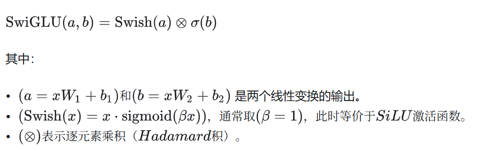

# SwiGLU

Owner: 吉祥 郑



# Swish

这个激活函数在0附近更加平滑

# **Gated Linear Unit**

门控网络，选择重要特征，经过一个子网络得到权重，再与原始的特征逐元素相乘

# 代码实现

```python
class SwiGLUMLP(nn.Module):
    def __init__(self, d_model: int, d_ff: int, dropout: float = 0.0, bias: bool = True):
        super().__init__()
        # 先到 2*d_ff（为了后面 chunk 成两半）
        self.w_in  = nn.Linear(d_model, 2 * d_ff, bias=bias) # 升维
        self.w_out = nn.Linear(d_ff, d_model, bias=bias)
        self.dropout = nn.Dropout(dropout)

    def forward(self, x):
        h = self.w_in(x)
        a, b = h.chunk(2, dim=-1) # 升维之后掰成两半
        x = F.silu(a) * b
        x = self.w_out(self.dropout(x))
        return x

```

# 优势

- 在0附近更平滑
- 门控网络引入了更多非线性操作，表达能力强
- 通过门控机制，使得模型能够选择性地通过信息，从而提高模型的表达能力