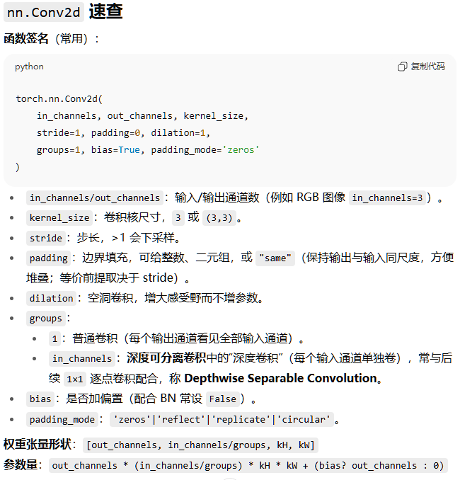
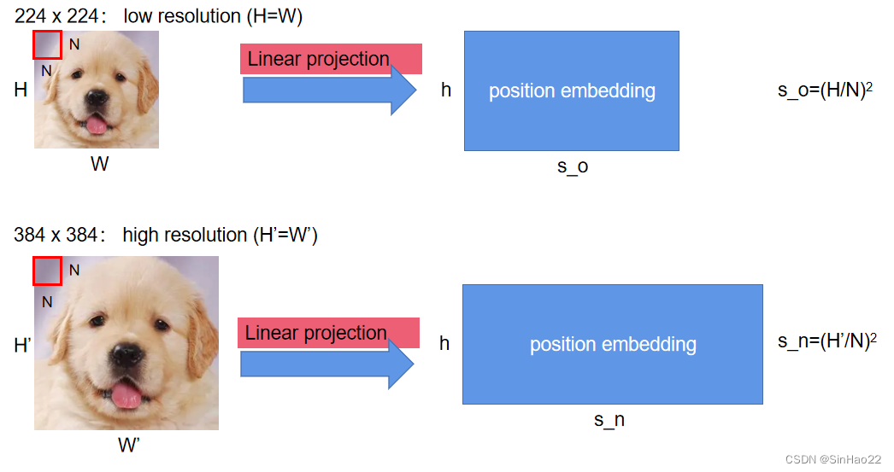

# ViT

Owner: 吉祥 郑

[(3 封私信) 全网最强ViT (Vision Transformer)原理及代码解析 - 知乎](https://zhuanlan.zhihu.com/p/427388113)

[(3 封私信) 再读VIT，还有多少细节是你不知道的 - 知乎](https://zhuanlan.zhihu.com/p/657666107)

# 卷积神经网络

## 定义和特性

用一个小窗口（卷积核/滤波器）在图片上**滑动**，对局部区域做加权求和，再叠加非线性（如 ReLU）：

- 每一个核是**(in_channel, H, W)**的形状，和局部的patch进行加权求和，得到一个值，如果想要得到一个高维的向量，那么需要**out_channel**个这样的卷积核
- 参数共享，同一个卷积核可以在全图复用，生成多个新的“像素点”（感受野）
- 局部连接，图像的有用信息通常是局部的，不需要让卷积核“看”一整张图片
    - kernel size决定新的特征“看”图片中多大的范围
    - stride决定了新的感受野的个数
- 平移等变，输入平移，特征图也等量平移



## pooling

对每个通道的特征图，用一个小窗口在空间维度上**滑动**，把窗口内的一堆数**汇聚成一个数**（比如取最大值或均值），从而实现**下采样**与**信息聚合**。

**作用**

- **下采样**：减小特征图分辨率，降低计算与显存；扩大后续层的**有效感受野**。
- **平移“近似不变”**：小范围位移不改变池化输出太多（尤其是平均/全局池化），对位置抖动更鲁棒。
- **去噪与信息汇聚**：平均池化当低通，最大池化保留最显著响应，抑制弱噪声。
- **结构化归一**：检测里把任意大小区域变成固定大小特征（更精确地有 ROI Pool/ROI Align，用于目标检测头）。
- **参数为零**：与 stride 卷积相比，池化本身不引入参数，有时更稳定。

# ViT结构

ViT长得很像一个BERT，最后也是用CLS token处的hidden states进行类别的预测

ViT能用一个很简单的线性层就进行分类，原因是它的特征提取能力很强，因此**简单分类器+强特征提取器，就是一个很好的分类器**


# patch token


**为什么分patch：**

- patch越大，token越少，计算效率越高
- 图像有冗余信息，不需要很细粒度地提取特征

**图片分块，使用CNN进行特征提取：**

- 卷积核尺寸和步长都为patch size，把图像整齐的切块
- 卷积核将( B, C, H, W )→（B, img_embed_sz, grid_size, grid_size)

```python
class PatchEmbed(nn.Module):
    """ 2D Image to Patch Embedding
    """
    def __init__(self, img_size=224, patch_size=16, in_chans=3, embed_dim=768, norm_layer=None, flatten=True):
        super().__init__()
        img_size = to_2tuple(img_size)
        patch_size = to_2tuple(patch_size)
        self.img_size = img_size
        self.patch_size = patch_size
        # token的形状
        self.grid_size = (img_size[0] // patch_size[0], img_size[1] // patch_size[1])
        self.num_patches = self.grid_size[0] * self.grid_size[1]
        self.flatten = flatten
        # 输入通道，输出通道，卷积核大小，步长
        # C*H*W->embed_dim*grid_size*grid_size
        self.proj = nn.Conv2d(in_chans, embed_dim, kernel_size=patch_size, stride=patch_size)
        self.norm = norm_layer(embed_dim) if norm_layer else nn.Identity()

    def forward(self, x):
        B, C, H, W = x.shape
        # C*H*W->embed_dim*grid_size*grid_size
        x = self.proj(x)
        if self.flatten:
            x = x.flatten(2).transpose(1, 2)  # BCHW -> BNC
        x = self.norm(x)
        return x
```

# Embedding

## token embedding

上面的分patch使用CNN得到一个初始的特征，只是分出了一个基本的token，**就像是LLM里面把文本对应一个token id**，还需要过一个embedding层，才是token embedding

## position embedding（可学习的位置编码）

类似于一个max_position * hidden_sz的表格，输入位置id i，就会得到一个position embedding

# 2D插值：finetune时的图片比预训练时大怎么办

[【ViT 微调时关于position embedding如何插值（interpolate）的详解】_vit position embedding-CSDN博客](https://blog.csdn.net/qq_44166630/article/details/127429697)

transformer encoder可以处理无限长的序列，但是position embedding长度有限，因此无法直接对BERT/ViT进行外推

如果图片的分辨率比训练时候要大，那么相当于token数目比预训练的时候更大，只有位置编码的部分需要改变，进行插值：



