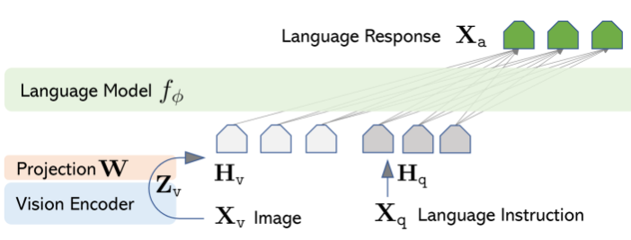
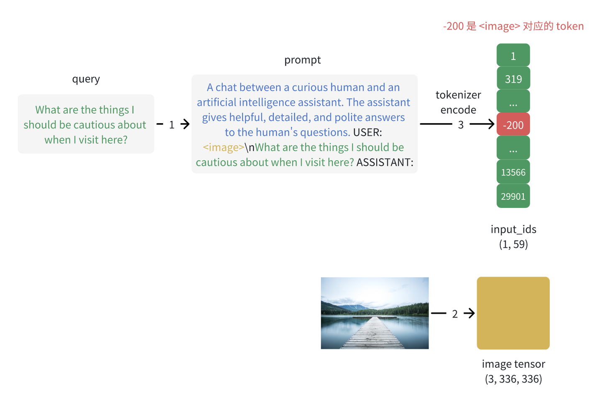
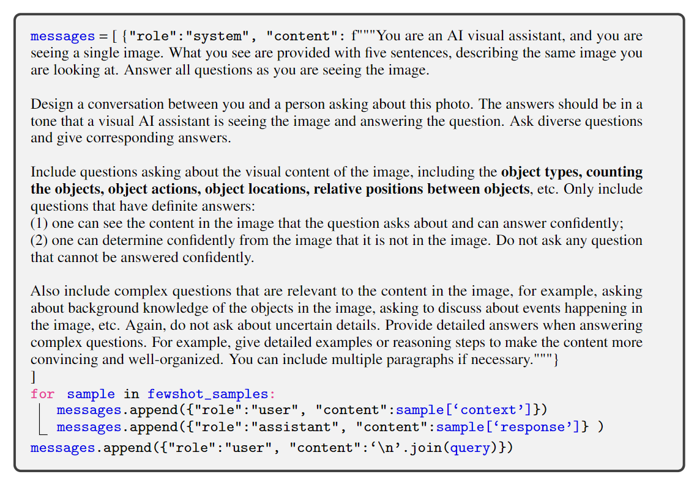

# llava

Owner: 吉祥 郑

[(3 封私信) LLaVA（一）LLaVA 论文解读 - 知乎](https://zhuanlan.zhihu.com/p/696112028)

# 模型构成

- Vicuna做语言backbone
- CLIP预训练的VIT作为视觉编码器，并通过一个小的MLP（2层）将视觉编码对齐到文本模态中
    - CLIP预训练后的视觉编码器，进行了大量跨模态的对比学习，比一般的VIT更好进行语义对齐
    - 这样的视觉编码器的开放词表（不是固定分类）能力强，长尾泛化能力（可以分辨出一些很细小的子类，也就是不仅能分辨出人，还能分辨出穿着红衣服的人）好



# 两阶段微调

## 阶段1 feature alignment：图像embedding和文本embedding对齐

这个阶段，**冻结LLM和图像编码器，训练映射层W**，使用简单的单轮对话，不涉及任何复杂任务，目的是对齐模态

这样的image caption数据是很多的，如果一上来就进行困难任务的学习，模型除了要对齐模态还要学习instruction following效果就会差

```json
{
  "image": "GCC_train_001234567.jpg",
  "conversations": [
    {"from": "human", "value": "Describe the image concisely.\n<image>"},
    {"from": "gpt",   "value": "a group of seabirds standing on a beach at sunrise."}
  ]
}

```

## 阶段2 Visual Instruction Tuning：教会模型复杂任务

冻结视觉编码器，微调LLM和线性层

任务数据有3类：

- 多轮对话数据
- 细节描述的对话数据
- 复杂推理数据

# llava是怎么拼接文本和图像token的

## 预处理

- 把prompt中的文本变为token，同时把在图片出现的位置使用一个占位符标定
- 把图片进行预处理，裁剪，通道拆分等



## 拼接

最主要的目的是把图像占位符换成一连串的图像token，进行自回归推理

自回归推理的过程中不会要求图片的位置进行自回归loss的计算：

- 因为最后进行softmax之后是会把embedding映射回词表空间的，而图像embedding是连续的
- llava是看图说话，而不是生成图片
- 强迫LLM去拟合图片token，会破坏语言的能力

```python
# llava/model/llava_arch.py
class LlavaMetaForCausalLM(ABC):

    def prepare_inputs_labels_for_multimodal(
        self,
        input_ids,
        position_ids,
        attention_mask,
        past_key_values,
        labels,
        images,
        image_sizes=None,
    ):
        ...
        if type(images) is list or images.ndim == 5:
            ...
        else:
            # 计算视觉特征
            # T_img是image token的数量
            image_features = self.encode_images(images) # [B', T_img, D]

        ...
        new_input_embeds = []
        new_labels = []
        cur_image_idx = 0
        for batch_idx, cur_input_ids in enumerate(input_ids):
            num_images = (cur_input_ids == IMAGE_TOKEN_INDEX).sum()
            ...

            # 计算文本特征
            # 找到所有的image label，下面在头加-1，尾加len是为了方便分割出非图片的文本
            image_token_indices = (
                [-1]
                + torch.where(cur_input_ids == IMAGE_TOKEN_INDEX)[0].tolist()
                + [cur_input_ids.shape[0]]
            )
            cur_input_ids_noim = []
            cur_labels = labels[batch_idx]
            cur_labels_noim = []
            for i in range(len(image_token_indices) - 1):
		            # 分割文本输入
                cur_input_ids_noim.append(
                    cur_input_ids[
                        image_token_indices[i] + 1 : image_token_indices[i + 1]
                    ]
                )
	              # 分割对应的文本输出
                cur_labels_noim.append(
                    cur_labels[image_token_indices[i] + 1 : image_token_indices[i + 1]]
                )
            # 文本被图片占位符切分为很多组token
            split_sizes = [x.shape[0] for x in cur_labels_noim]
            
            # 先获取所有的文本的embedding
            cur_input_embeds = self.get_model().embed_tokens(
                torch.cat(cur_input_ids_noim)
            )
            # 将embedding按照上面的分割方式再进行分组
            cur_input_embeds_no_im = torch.split(cur_input_embeds, split_sizes, dim=0)

            cur_new_input_embeds = []
            cur_new_labels = []

            # 将视觉特征和文本特征拼在一起
            # 通过image token数就可以知道有几个图片
            for i in range(num_images + 1):
                cur_new_input_embeds.append(cur_input_embeds_no_im[i])
                cur_new_labels.append(cur_labels_noim[i])
                if i < num_images:
		                # 全局变量cur_image_idx，控制当前的batch需要哪些图片
                    cur_image_features = image_features[cur_image_idx]
                    cur_image_idx += 1
                    cur_new_input_embeds.append(cur_image_features)
                    cur_new_labels.append(
                        torch.full(
                            (cur_image_features.shape[0],),
                            IGNORE_INDEX,
                            device=cur_labels.device,
                            dtype=cur_labels.dtype,
                        )
                    )
        ...

        return (
            None,
            position_ids,
            attention_mask,
            past_key_values,
            new_input_embeds,
            new_labels,
        )

```

# 数据集生成pipeline

使用GPT-4将带有bounding box信息的coco数据集，转换为了一个有3类任务的instruction following数据集，以conversation为例介绍如何生成这样的数据

GPT4并不能看到图片，因此只是让模型假装可以看见图片，根据图片的描述生成多轮对话：

- 使用ICL方式，给出了一些问题和回答的示例
- 图片是有描述的，还有bounding box
- 只会提出有确定答案的问题

