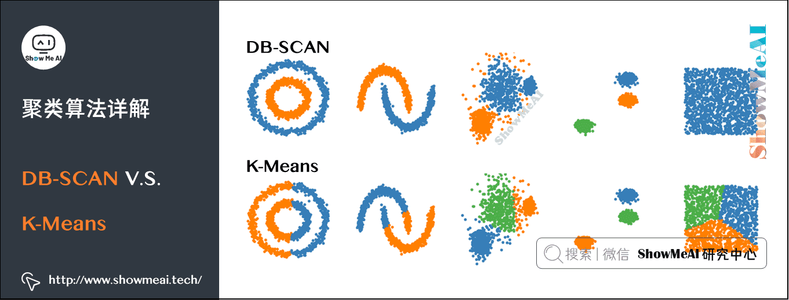

# DB-SCAN

Owner: 吉祥 郑

DB-SCAN 是一个基于密度的聚类。如下图中这样不规则形态的点，如果用 K-Means，效果不会很好。而通过 DB-SCAN 就可以很好地把在同一密度区域的点聚在一类中。

这个过程用直白的语言描述就是：

- 对于一个数据集，先规定最少点密度 MinPts 和半径范围。
- 先找出核心对象：如果在半径范围内点密度大于 MinPts，则这个点是核心对象。把所有的核心对象放到一个集合中。
- 从这个核心对象集合中，随机找一个核心对象，判断其它的数据点与它是否密度直达，如果是，则归入聚类簇中。
- 继续判断其它点与聚类簇中的点是否密度直达，直到把所有的点都检查完毕，这时候归入聚类簇中的所有点是一个密度聚类。